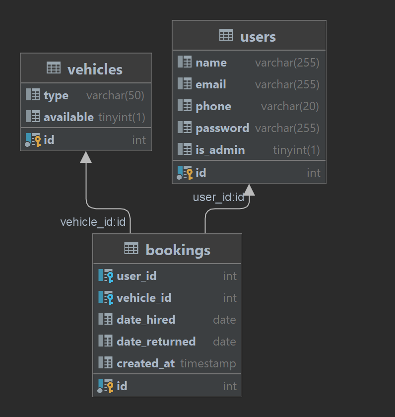

# Car Rental Management System

This repository contains the code for a Car Rental Management System, providing functionalities to manage customers, vehicles, and booking reservations. It's built as a RESTful API.

## Project Overview

The system includes endpoints to manage customers, vehicles, and bookings. It offers functionalities accessible via HTTP requests.

## Database Diagram



## Getting Started

Follow these steps to set up and run the project:

1. Clone this repository.
2. Install the required dependencies using `pip install -r requirements.txt`.
3. Set up the database and configure environment variables in `.env`.
4. Run the application with `python -m flask run`.

## Endpoints

### Authentication

- **Signup**: Create a new user account.
    ```bash
    curl -X POST -H "Content-Type: application/json" -d '{
        "name": "John Doe",
        "email": "john@example.com",
        "phone": "1234567890",
        "password": "securepassword"
    }' http://your_domain/signup
    ```

- **Login**: Authenticate and obtain an access token.
    ```bash
    curl -X POST -H "Content-Type: application/json" -d '{
        "email": "john@example.com",
        "password": "securepassword"
    }' http://your_domain/login
    ```

### Admin Routes

#### Customers

- **Create Customer**: Create a new customer (Admin access required).
    ```bash
    curl -X POST -H "Content-Type: application/json" -H "Authorization: Bearer <access_token>" -d '{
        "name": "Alice",
        "email": "alice@example.com",
        "phone": "9876543210",
        "password": "strongpassword"
    }' http://your_domain/admin/customers
    ```

- **Get Customer by ID**: Retrieve a customer by ID (Admin access required).
    ```bash
    curl -X GET -H "Authorization: Bearer <access_token>" http://your_domain/admin/customers/<customer_id>
    ```

- **Update Customer by ID**: Update a customer by ID (Admin access required).
    ```bash
    curl -X PUT -H "Content-Type: application/json" -H "Authorization: Bearer <access_token>" -d '{
        "name": "Alice",
        "email": "alice@example.com",
        "phone": "9876543210",
        "password": "updatedpassword"
    }' http://your_domain/admin/customers/<customer_id>
    ```

- **Delete Customer by ID**: Delete a customer by ID (Admin access required).
    ```bash
    curl -X DELETE -H "Authorization: Bearer <access_token>" http://your_domain/admin/customers/<customer_id>
    ```

#### Vehicles

- **Create Vehicle**: Create a new vehicle (Admin access required).
    ```bash
    curl -X POST -H "Content-Type: application/json" -H "Authorization: Bearer <access_token>" -d '{
        "type": "small_cars",
        "available": true
    }' http://your_domain/admin/vehicles
    ```

- **Get Vehicle by ID**: Retrieve a vehicle by ID (Admin access required).
    ```bash
    curl -X GET -H "Authorization: Bearer <access_token>" http://your_domain/admin/vehicles/<vehicle_id>
    ```

- **Update Vehicle by ID**: Update a vehicle by ID (Admin access required). Restrict the `type` field to predefined types: 'small_cars', 'family_cars', 'vans'.
    ```bash
    curl -X PUT -H "Content-Type: application/json" -H "Authorization: Bearer <access_token>" -d '{
        "type": "small_cars",
        "available": false
    }' http://your_domain/admin/vehicles/<vehicle_id>
    ```

- **Delete Vehicle by ID**: Delete a vehicle by ID (Admin access required).
    ```bash
    curl -X DELETE -H "Authorization: Bearer <access_token>" http://your_domain/admin/vehicles/<vehicle_id>
    ```

### Booking Routes

- **Make Booking**: Make a vehicle booking (Authenticated customer access required).
    ```bash
    curl -X POST -H "Content-Type: application/json" -H "Authorization: Bearer <access_token>" -d '{
        "vehicle_id": <vehicle_id>,
        "date_hired": "YYYY-MM-DD",
        "date_returned": "YYYY-MM-DD"
    }' http://your_domain/make_booking
    ```

## Usage Instructions

- Ensure correct payload format for requests.
- Authenticate using obtained access tokens.
